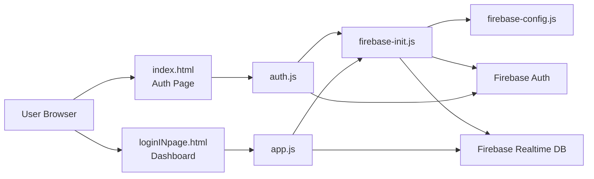
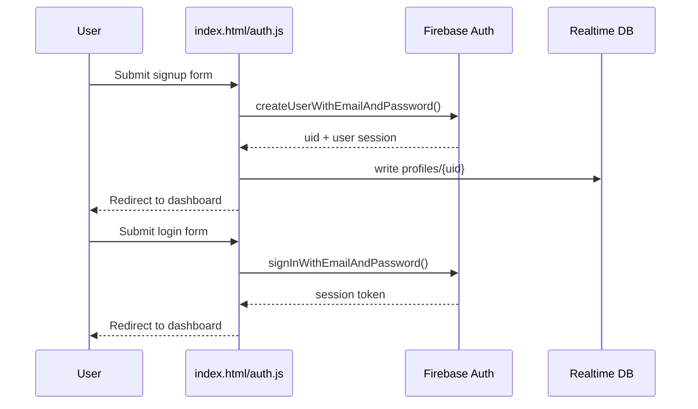
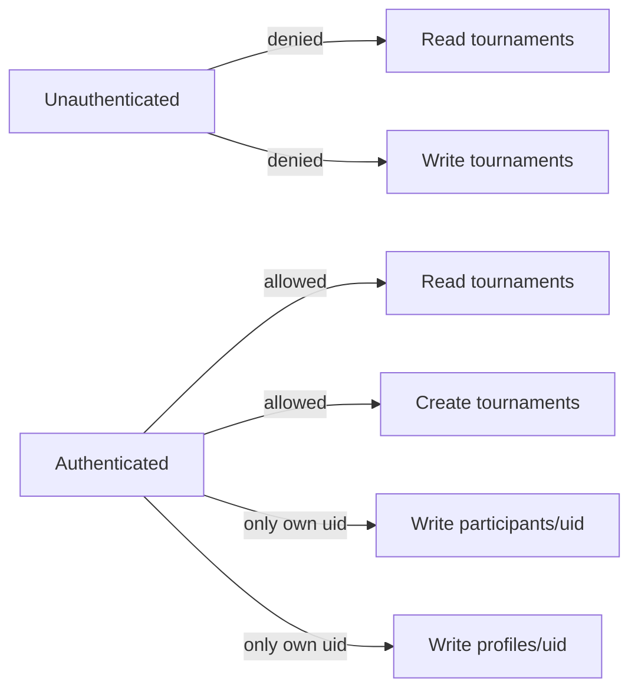

# Battle Tourney Workflow

This document explains what was improved, how the app is built, and how to reproduce the full setup and deployment step by step.

## 1) What was changed

### Security fixes

- Removed insecure plaintext password storage from client code.
- Added Firebase Realtime Database security rules in `database.rules.json`.
- Added authentication checks before dashboard access.
- Added safer hosting headers in `firebase.json`.
- Split Firebase configuration and initialization into dedicated files.

### Reliability and UX improvements

- Rebuilt login/signup flow with validation and feedback.
- Rebuilt dashboard logic for creating and joining tournaments.
- Added deterministic participant-based bracket preview.
- Improved responsive UI and component structure in `style.css`.
- Added default Firebase project mapping in `.firebaserc`.

### Project operations

- Added runnable scripts in `package.json`.
- Set local serve port to `8000` (works better on your machine).

---

## 2) Current architecture



### File responsibilities

- `public/index.html` — login/signup entry page.
- `public/auth.js` — signup/login handlers and auth state redirect.
- `public/loginINpage.html` — authenticated tournament dashboard.
- `public/app.js` — create/join/list tournaments + simple bracket renderer.
- `public/firebase-config.js` — Firebase project credentials.
- `public/firebase-init.js` — one-time app initialization and SDK references.
- `database.rules.json` — authorization and validation layer for RTDB.
- `firebase.json` — hosting config and security headers.

---

## 3) App runtime flow

### Authentication flow



### Tournament flow

```mermaid
flowchart TD
  A[Authenticated User] --> B[Create Tournament]
  B --> C[Write tournaments/{id}]
  C --> D[Owner auto-added to participants]
  D --> E[Live list refresh via on value listener]

  A --> F[Join Tournament]
  F --> G[Write tournaments/{id}/participants/{uid}]
  G --> E

  E --> H[Generate bracket pairs]
  H --> I[Render simple bracket cards]
```

---

## 4) Reproduce from scratch (step-by-step)

## Prerequisites

- Node.js + npm installed
- Python 3 installed (for local static server)
- Firebase project created
- Firebase Authentication enabled (Email/Password)
- Firebase Realtime Database created

## Setup steps

1. Open terminal in project folder:

```powershell
cd "c:\Users\moham\Downloads\Projects\github\tour1"
```

2. Install local dev dependency (already done in your folder):

```powershell
npm install --save-dev firebase-tools
```

3. Ensure Firebase config exists:

- `public/firebase-config.js` should contain your Firebase web config.
- Use `public/firebase-config.example.js` as template if needed.

4. Start local server:

```powershell
npm run serve
```

5. Open app:

- `http://localhost:8000`

---

## 5) Deploy process

1. Authenticate Firebase CLI:

```powershell
npx firebase-tools login
```

2. Confirm selected project:

```powershell
npx firebase-tools use battletour-9dc70
```

3. Deploy hosting + rules:

```powershell
npx firebase-tools deploy
```

4. Optional deploy database rules only:

```powershell
npx firebase-tools deploy --only database
```

---

## 6) Security model summary



- All top-level reads/writes are denied by default.
- Tournament read/write requires authenticated user.
- Participant writes are restricted to `auth.uid` owner path.
- Profile read/write is restricted to the owning user path.

---

## 7) Troubleshooting

- **Error: Failed to authenticate, have you run firebase login?**  
  Run: `npx firebase-tools login`

- **Port 5500 blocked/permission issue on Windows**  
  Use current script (`8000`) with `npm run serve`.

- **Firebase config missing error**  
  Create/update `public/firebase-config.js` with valid keys.

- **Database permission denied**  
  Deploy rules: `npx firebase-tools deploy --only database`

---

## 8) Build checklist

- [x] Auth flow secured
- [x] Plaintext password storage removed
- [x] Dashboard access gated by auth
- [x] Tournament CRUD/join working
- [x] Bracket preview rendering
- [x] Firebase rules added
- [x] Hosting config hardened
- [x] Reproducible workflow documented
